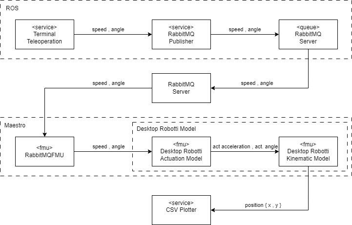

# Desktop Robotti Movement Simulation

## Overview

The purpose of this example is simulate the behaviours of the Desktop Robotti in a simulation setting, where the user can alter steering and speed in real time with the simulation. The outcome of this is to simulate the behavior of the physical robot with a real time plotting that yields the _(x,y)_ position of the robot.

This example demonstrates the usage of ROS on the DTaaS platform, including the RabbitMQ message broker. Thus, the RabbitMQFMU is used for handling communation into the simulation world and a ROS to RabbitMQ bridge is used to parse the messages.

The digital twin consists of a FMI-based co-simulation, where Maestro is used as co-orchestration engine. In this case, the co-simulation is created using three FMUS, the RabbitMQFMU as broker client, along with a two other FMU's to represent the actual behavior of the Desktop Robotti robot. These consist of an actuation model to calculate the actuated angle and acceleration, which are being parsed to kinematic model, that will yield the _(x,y)_ position.

The following shows an overview of the system:

## Configure

This example uses the RabbitMQ broker. Thus, a RabbitMQ service is required for running the experiment. To run the example two files need to be modified with connection parameters. As for now this is example are only being used for demonstration purposes and are only set up for non encrypted plain text authentication. If the server does not require authentication the setting parameters can be removed from the configuration files.

Configuration files:

1. ros2_parameters.yaml     - Connection parameters for ROS -> RabbitMQ
2. multimodel.json          - Connection parameters for RabbitMQ -> Simulation

## Lifecycle Phases

The following lifecycle phases are covered in this setting.

1) __create__ - Installation of dependencies in the create phase.
2) __execute__ - Executing the simulation (Runs 30 seconds)
3) __terminate__ - Stop running backgorund processess
4) __clean__ - Remove generated simulation outputs

## Results

Creating the simulation will launch a deploying script that will deploy ROS, and fetch user services for executing the simulation. This will take approximately 10-15 minutes.

Executing the simulation / DT setting will launch the background process for parsing the data from ROS2 to the simulatioon, after which it will generate the simulation specification files and run the simulation. After the simulation is started it will launch and present a console teleoperation service that the user can alter the movement settings.

The results can be plottted by running the jupyter plot_xy_coordinate.ipynb file.

## Future work

It may be considered to add position data from the real Desktop Robotti robot, to show the actual behavior of the real robot, compared to its digital twin counterpart showed in this example. In fact, that would make it a truly digital twin/shadow, to show of the DTaaS platform.

## References

See the [ROS2](https://www.ros.org/) documentation.

The RabbitMQ to ROS message parser and teleoperation is located at the [drobotti-processing-and-control](https://gitlab.au.dk/desktop_robotti/drobotti-processing-and-control) repository.

Documentation regarding the [RabbitMQFMU](https://github.com/INTO-CPS-Association/fmu-rabbitmq)

Desktop Robotti movement simulation FMU's can be found in the [drobotti-intocps](https://gitlab.au.dk/desktop_robotti/drobotti-intocps) repository.