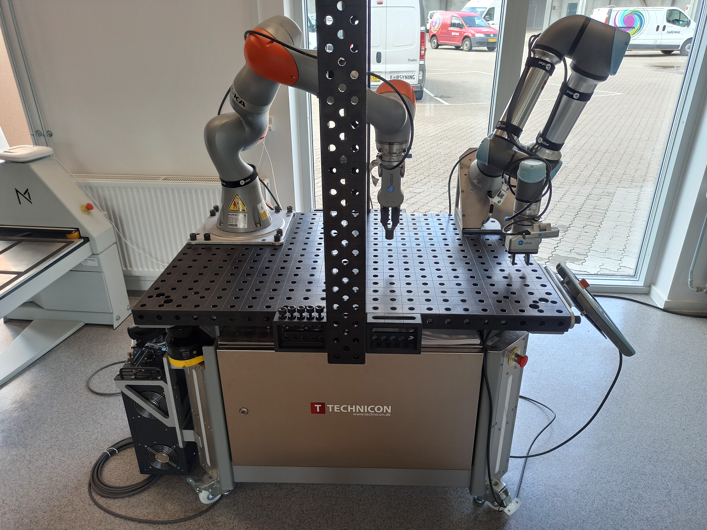
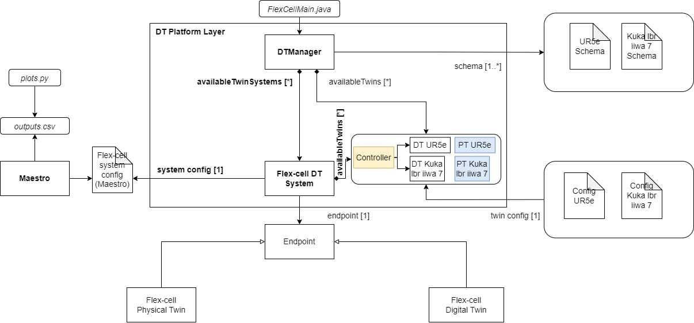
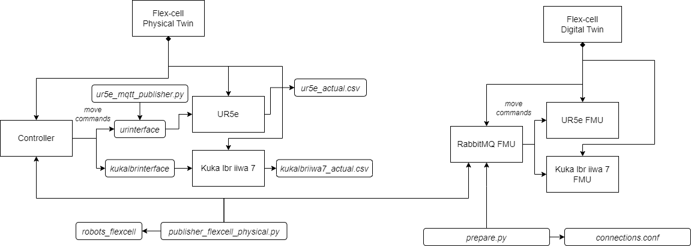

# Flex-cell Digital Twin
## Overview
The flex-cell Digital Twin is a case study with two industrial robotic arms, a UR5e and a Kuka LBR iiwa 7, working in a cooperative setting on a manufacturing cell.



The case study focuses on the robot positioning in the discrete cartesian space of the flex-cell working space.
Therefore, it is possible to send (X,Y,Z) commands to both robots, which refer to the target hole and height they want should move to.

The flex-cell case study is managed using the ```DTManager```, which is packed as a jar library in the tools, and run from a java main file.
The ```DTManager``` uses Maestro as a slave for co-simulation, so it generates the output of the co-simulation and can interact with the real robots at the same time (with the proper configuration and setup).
The mainfile can be changed according to the application scope, i.e., the ```/workspace/examples/tools/flex-cell/FlexCellMain.java``` can be manipulated to get a different result.

The ```/workspace/examples/models/flex-cell/``` folder contains the ```.fmu``` files for the kinematic models of the robotic arms and the ```.aasx``` files for the schema representation with Asset Administration Shell.
The case study also uses RabbitMQFMU to inject values into the co-simulation, therefore, there is the rabbitmqfmu in the models folder as well.
Right now, RabbitMQFMU is only used for injecting values into the co-simulation, but not the other way around.
The ```DTManager``` is in charge of reading the values from the co-simulation output and the current state of the physical twins.

## Example Structure
The structure of this example is split into two figures.
The first one shows the architecture for the flex-cell example using the DT Manager. See [References](#references) for more detail.




The second one shows the details of the internal assets of the physical twin and the digital twin, where the FMU models and the communication interfaces, including RabbitMQ, FMU are used.



## Digital Twin Configuration
This example uses seven models, five tools, six data, two functions, and one script. The specific assets used are:

| Asset Type | Name of Assets | Name in the Example Structure | Visibility | Reuse in Other Examples |
|:---|:---|:---|:---|:---|
| Model | kukalbriiwa_model.fmu | Kuka lbr iiwa 7 FMU | Private | No |
|  | kuka.aasx | Kuka lbr iiwa 7 Schema | Private | No |
|  | ur5e_model.fmu | UR5e FMU | Private | No |
|  | ur5e.aasx | UR5e Schema | Private | No |
|  | rmq-vhost.fmu | RabbitMQ FMU | Private | Yes |
| Tool | maestro-2.3.0-jar-with-dependencies.jar | Maestro | Common | Yes |
|  | DTManager-0.0.1-Maestro.jar | DTManager | Private | Yes |
|  | urinterface | *urinterface* | Private | No |
|  | kukalbrinterface | *kukalbrinterface* | Private | No |
|  | robots_flexcell | *robots_flexcell* | Private | No |
|  | FlexCellMain.java (main script) | *FlexCellMain.java* | Private | No |
| Data | publisher-flexcell-physical.py | *publisher-flexcell-physical.py* | Private | No |
|  | ur5e_mqtt_publisher.py | *ur5e_mqtt_publisher.py* | Private | No |
|  | connections.conf | *connections.conf* | Private | No |
|  | outputs.csv | *outputs.csv* | Private | No |
|  | kukalbriiwa7_actual.csv | *kukalbriiwa7_actual.csv* | Private | No |
|  | ur5e_actual.csv | *ur5e_actual.csv* | Private | No |
| Function | plots.py | *plots.py* | Private | No |
|  | prepare.py | *prepare.py* | Private | No |

## Lifecycle Phases
The lifecycles that are covered include:
1. Installation of dependencies in the create phase.
2. Preparing the credentials for connections in the prepare phase.
3. Execution of the experiment in the execution phase.
4. Saving experiments in the save phase.
5. Plotting the results of the co-simulation and the real data coming from the robots in the analyze phase.
6. Terminating the background processes and cleaning up the outputs in the termination phase.

## Run the Example
The order the run this example is:
1. Run the create script file with ```/workspace/examples/digital_twins/flex-cell/lifecycle/create```. In case of error, be sure the installed version of Java is OpenJDK 11, otherwise, install manually the OpenJDK 11 and use the command ```update-java-alternatives``` to set the Java version to be OpenJDK 11 and rerun the ```create``` script.
2. Set up the credentials in the ```/workspace/examples/data/flex-cell/connections.conf``` and run the script file ```./workspace/examples/digital_twins/flex-cell/lifecycle/prepare```.
3. Execute the Digital Twin with the script file ```/workspace/examples/digital_twins/flex-cell/lifecycle/execute```. **Remark**: You need to terminate the ```execute``` script by pressing ```Control + C``` since the application opens a loop that runs forever.
4. (Optional) save the results with the script file ```/workspace/examples/digital_twins/flex-cell/lifecycle/save```.
5. (Optional) plot the results with the script file ```/workspace/examples/digital_twins/flex-cell/lifecycle/analyze```, which saves the plots in the folder ```/workspace/examples/data/flex-cell/output```.
6. Terminate the background processes with the script file ```/workspace/examples/digital_twins/flex-cell/lifecycle/terminate```. This one is required before running an execution again.
7. (Optional) clean up the output folder with the script file ```/workspace/examples/digital_twins/flex-cell/lifecycle/clean```. **Remark**: This command can also remove the files in the ```physical_twin``` subfolder with the data from the real robots. See the script for further information.

## Examining the results
Executing this Digital Twin will generate a co-simulation output, but the results can also be monitored from updating the ```/workspace/examples/tools/flex-cell/FlexCellMain.java``` with a specific set of ```getAttributeValue``` commands, such as shown in the code.
That main file enables the online execution and comparison on Digital Twin and Physical Twin at the same time and at the same abstraction level.

The output is generated to the ```/workspace/examples/data/flex-cell/output``` folder.
In case a specific experiments is to be saved, the ```save``` lifecycle script stores the co-simulation results into the ```/workspace/examples/data/flex-cell/output/saved_experiments``` folder.

In the default example, the co-simulation is run for 10 seconds in steps of 0.5 seconds.
This can be modified for a longer period and different step size.
The output stored in ```outputs.csv``` contains the joint position of both robotic arms and the current discrete (X,Y,Z) position of the TCP of the robot.
Additional variables can be added, such as the discrete (X,Y,Z) position of the other joints.

When connected to the real robots, the tools ```urinterface``` and ```kukalbrinterface``` log their data at a higher sampling rate.


## Connection setup
The files ```/workspace/examples/digital_twins/flex-cell/kuka_actual.conf```, ```/workspace/examples/digital_twins/flex-cell/ur5e_actual.conf```, ```/workspace/examples/tools/flex-cell/publisher-flexcell-physical.py```, and the ```modelDescription.xml``` for the RabbitMQFMU require special credentials to connect to the RabbitMQ and the MQTT brokers.

The script file  ```/workspace/examples/digital_twins/flex-cell/lifecycle/prepare``` helps you to set up the credentials and connection parameters easily.
The only thing needed to set up the connection is to update the file ```/workspace/examples/data/flex-cell/connections.conf``` with the connection parameters for MQTT and RabbitMQ and then execute the ```prepare``` script.
The script will set up the RabbitMQFMU and config files for this example for you.

## References

The [RabbitMQ FMU](https://github.com/INTO-CPS-Association/fmu-rabbitmq)
github repository contains complete documentation and source code of
the rmq-vhost.fmu.

More information about the DT Manager and the case study is available at:

```txt
D. Lehner, S. Gil, P. H. Mikkelsen, P. G. Larsen and M. Wimmer, "An Architectural Extension for Digital Twin Platforms to Leverage Behavioral Models," 2023 IEEE 19th International Conference on Automation Science and Engineering (CASE), Auckland, New Zealand, 2023, pp. 1-8, doi: 10.1109/CASE56687.2023.10260417.
```
```txt
S. Gil, P. H. Mikkelsen, D. Tola, C. Schou and P. G. Larsen, "A Modeling Approach for Composed Digital Twins in Cooperative Systems," 2023 IEEE 28th International Conference on Emerging Technologies and Factory Automation (ETFA), Sinaia, Romania, 2023, pp. 1-8, doi: 10.1109/ETFA54631.2023.10275601.
```