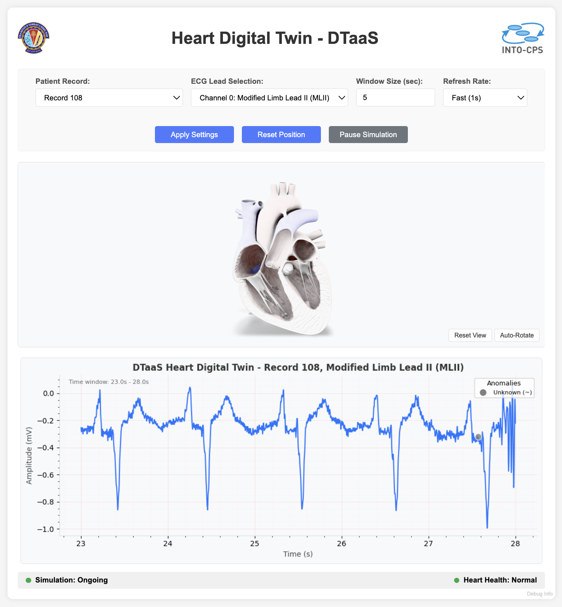

# Heart Digital Twin

## Overview

The Heart Digital Twin demonstrates a real-time cardiovascular monitoring system using ECG data from the MIT-BIH Arrhythmia Database. This digital twin provides live ECG visualization with anomaly detection and features an interactive 3D heart model that synchronizes with the cardiac rhythm, creating an immersive healthcare monitoring experience within the DTaaS platform.

## Example Structure

The Heart Digital Twin consists of several key components working together:

- **ECG Data Processing**: Real-time processing and visualization of electrocardiogram signals from the MIT-BIH database
- **3D Heart Visualization**: Interactive 3D heart model with synchronized pumping animation
- **Anomaly Detection**: Real-time identification and highlighting of cardiac anomalies
- **Web Interface**: Flask-based web application for real-time monitoring and control



## MIT-BIH Arrhythmia Database

This digital twin utilizes the renowned **MIT-BIH Arrhythmia Database**, which contains 48 half-hour excerpts of two-channel ambulatory ECG recordings. The database includes:

- Records from 47 subjects studied by the BIH Arrhythmia Laboratory
- 360 Hz sampling frequency with 11-bit resolution
- Expert annotations for arrhythmia detection and classification
- Multiple ECG channels (MLII, V1, V2, V4, V5) depending on the record

Records 100-109 are available for simulation, each containing different types of cardiac rhythms and anomalies for comprehensive testing and demonstration.

## Digital Twin Configuration

This example uses the following assets:

| Asset Type | Names of Assets | Visibility | Reuse in Other Examples |
|:---|:---|:---|:---|
| Data | MIT-BIH Arrhythmia Database Records (100-109) | Public | Yes |
| Models | 3D Heart Model (Beating heart.glb) | Public | Yes |
| Functions | ECG Processing & Anomaly Detection | Public | Yes |
| Tools | Flask Web Server & UI Components | Public | Yes |

The heart digital twin can be customized through various parameters:
- **Record Selection**: Choose from records 100-109
- **Channel Selection**: Switch between available ECG channels
- **Window Size**: Adjust the time window for real-time display
- **Update Frequency**: Control the refresh rate of the simulation

## 3D Heart Animation

The digital twin features a **synchronized 3D heart pumping animation** that enhances the monitoring experience:

- **Real-time Synchronization**: Heart model animation matches the ECG rhythm
- **Interactive Controls**: 
  - Camera controls for 360° viewing
  - Auto-rotate functionality
  - Reset view option
- **Animation Features**:
  - Realistic beating heart model
  - Smooth cardiac cycle animation
  - Pause/resume functionality synchronized with ECG simulation
- **Model Format**: High-quality GLB (GL Transmission Format Binary) 3D model
- **Rendering**: WebGL-based rendering using model-viewer component

The 3D heart provides visual feedback that correlates with the electrical activity shown in the ECG, making it easier to understand the relationship between electrical signals and mechanical heart function.

## Lifecycle Phases

| Lifecycle Phase | Completed Tasks |
| -------- | ------- |
| Create | Sets up Python virtual environment and installs required dependencies (NumPy, Pandas, Matplotlib, WFDB, Flask) |
| Execute | Starts the Flask web server and launches the heart monitoring interface accessible via web browser |
| Clean | Terminates the running application and removes the virtual environment |

## Run the example

To run the example, change your present directory:

```bash
cd /workspace/examples/digital_twins/heart_dt
```

If required, change the execute permission of lifecycle scripts you need to execute:

```bash
chmod +x lifecycle/create
chmod +x lifecycle/execute
chmod +x lifecycle/clean
```

Now, run the following scripts:

### Create

Sets up the Python environment and installs all required dependencies including WFDB for MIT-BIH data access, Flask for the web interface, and scientific computing libraries.

```bash
lifecycle/create
```

### Execute

Launches the Heart Digital Twin web application. The server will start and be accessible via web browser for real-time ECG monitoring and 3D heart visualization.

```bash
lifecycle/execute
```

The application will be available at `http://localhost:5001` and will automatically:
- Load required MIT-BIH records
- Initialize the ECG data processing
- Start real-time visualization
- Enable 3D heart model synchronization

#### Examine the results

Access the web interface to:
- **Monitor Real-time ECG**: View live electrocardiogram signals
- **Control Simulation**: Select different records, channels, and update frequencies
- **Interact with 3D Heart**: Rotate, zoom, and control the heart animation
- **Detect Anomalies**: Observe highlighted cardiac irregularities
- **Pause/Resume**: Control the simulation flow

Application logs can be found in the `logs/heart_dt.log` file for debugging and monitoring purposes.

### Clean

Terminates the running application and cleans up the environment.

```bash
lifecycle/clean
```

This will:
- Stop the Flask web server
- Remove the Python virtual environment
- Clean up any temporary files

## References

More information about the MIT-BIH Arrhythmia Database and cardiac monitoring:

```txt
Moody GB, Mark RG. The impact of the MIT-BIH Arrhythmia Database. 
IEEE Eng in Med and Biol 20(3):45-50 (May-June 2001).
```

```txt
Goldberger, A., et al. PhysioBank, PhysioToolkit, and PhysioNet: 
Components of a new research resource for complex physiologic signals. 
Circulation 101(23):e215-e220, 2000.
```

The MIT-BIH Arrhythmia Database is available at:
[https://physionet.org/content/mitdb/](https://physionet.org/content/mitdb/)