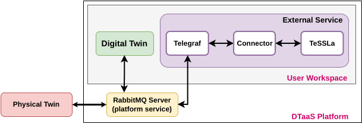

# Incubator Digital Twin with TeSSLa monitoring service

## Overview

This example demonstrates how a runtime enforcement service (in this example implemented with the specification language TeSSLa[1]) can be connected with the [Incubator Digital Twin](../../common/digital_twins/incubator/README.md) to steer the behavior of the Incubator.

## Simulated scenario

The incubator is a device used to maintain the temperature inside a box within a pre-defined range.
In this specific scenario, the lid of the incubator is removed and later replaced. The incubator is equipped with anomaly detection capabilities that can detect anomalous behaviour (i.e. the removal of the lid). If an anomaly is detected, the incubator will, after a period of time, enter a power saving mode where the heating is turned off. The runtime enforcer provides the control signal for the power saving mode.


The simulated scenario is as follows:

- *Initialisation*: The services are initialised and the Kalman filter in the incubator is given 2 minutes to stabilise. 
- After 2 minutes*: The lid is lifted and an anomaly is detected.  The power saver is activated shortly after.
- After a further 30 seconds: The lid is replaced and the anomaly detector is given time to detect that the lid is back on. The simulation ends.
## Example structure

A diagram showing the logical software structure of the example is shown below.



The _execute.py_ script is responsible for orchestrating and starting all relevant services in this example. This includes the incubator DT, the TeSSLa runtime enforce as well as telegraf and the TeSSLa telegraf connector for communication between the DT and TeSSLa.

The telegraf client subscribes to the RabbitMQ server used by the DT for communication and forwards the messages on the topics *incubator.diagnosis.plant.lidopen* and *incubator.energysaver.status* to the TeSSLa telegraf connector, which feeds them as inputs to TeSSLa. TeSSLa then generates a control signal to activate or deactivate the energy saver mode. The signal is then sent back to Telegraf via the connector and published to RabbitMQ and printed on the console.

## Digital Twin configuration

Before running the example, please configure the _simulation.conf_ file with your RabbitMQ credentials.

The example uses the following assets:

| Asset Type | Names of Assets | Visibility | Reuse in other Examples |
|:---|:---|:---|:---|
| DT | common/digital_twins/incubator | Common | Yes |
| Specification | safe-operation.tessla | Private | No |
| Configuration | telegraf.conf | Private | No
| Script | execute.py | Private | No |

The _safe-operation.tessla_ file contains the default monitored specification as described in the [Simulated scenario section](#simulated-scenario). These can be configured as desired.

## Lifecycle phases

The lifecycle phases for this example include

| lifecycle phase | completed tasks |
| ------ | ------- |
| create | Downloads the required tools and creates a virtual Python environment with the required dependencies |
| Execute | Runs a Python script that starts the required services and the incubator simulation. Various status messages are printed to the console, including the monitored system states and the monitor verdict. |
| clean | Removes the created _data_ directory and the incubator log files. |

If necessary, change the execution privileges of any lifecycle scripts you need to run.
This can be done with the following command

```bash
chmod +x lifecycle/{script}
```

where {script} is the name of the script, e.g. _create_, _execute_, etc.

## Running the example

To run the example, first run the following command in a terminal

```bash
cd /workspace/examples/digital_twins/incubator-tessla-active-monitor/
```

Then run the _create_ script (this may take a few minutes depending on your network connection) followed by the _execute_ script using the following command

```bash
lifecycle/{script}
```

The _execute_ script will then start outputting system status and monitor verdict approximately every 3 seconds. 


## References
1.    [tessla.io](https://tessla.io)


