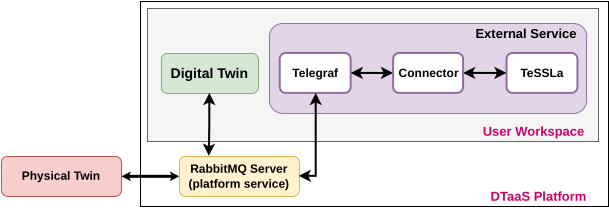

# Incubator Digital Twin with TeSSLa monitoring service

adapted from [NuRV](../incubator-NuRV-monitor-service/README.md)

## Overview

This example demonstrates how a runtime monitoring service (in this example TeSSLa[1]) can be connected with the [Incubator digital twin](../../common/digital_twins/incubator/README.md) to verify runtime behavior of the Incubator. It is describes the active and passive example, as only the TeSSLa specification and Telegraf configuration change between the examples and the overall setup and handling persists.

## Simulated scenario

This example simulates a scenario where the lid of the Incubator is removed and
later put back on. The Incubator is equipped with anomaly detection capabilities,
which can detect anomalous behavior (i.e. the removal of the lid). When an anomaly
is detected, the Incubator triggers an energy saving mode where the heater is
turned off.

From a monitoring perspective, we wish to verify that within 3 simulation steps
of an anomaly detection, the energy saving mode is turned on. To verify this
behavior, we construct the property:
$`G(anomaly \rightarrow (F_{[0,3]}\space energy\_saving))`$.
The monitor will output the _Unknown_ state as long as the property is satisfied and will transition to the _False_ state once a violation is detected.

The simulated scenario progresses as follows:

- *Initialization*: The services are initialized and the Kalman filter in
  the Incubator is given 2 minutes to stabilize. Sometimes, the anomaly detection
  algorithm will detect an anomaly at startup even though the lid is still on.
  It will disappear after approx 15 seconds.
- *After 2 minutes*: The lid is lifted and an anomaly is detected.
  The energy saver is turned on shortly after
- *After another 30 seconds*: The energy saver is manually disabled producing
  a False verdict.
- *After another 30 seconds*: The lid is put back on and the anomaly detection
  is given time to detect that the lid is back on. The monitor is then reset producing an Unknown verdict again. The simulation then ends.

## Example structure

A diagram depicting the logical software structure of the example can be seen below.



The _execute.py_ script is responsible for orchestrating and starting all
the relevant services in this example. This includes the Incubator DT,
the TeSSLa monitor as well as telegraf and the TeSSLa-Telegraf-Connector for communication between the DT and TeSSLa monitor.

The telegraf client subscribes to the RabbitMQ server used for communication by the DT and relays the messages on the *incubator.diagnosis.plant.lidopen* and *incubator.energysaver.status* topics to the TeSSLa-Telegraf-Connector which feeds them as inputs to the TeSSLa monitor. TeSSLa then reaches a verdict based on this new state together with previously received states. The verdict is then output back to telegraf via the connector and published to the *incubator.energysaver.alert* topic and printed on the console.

## Digital Twin configuration

Before running the example, please configure the _simulation.conf_ file with
your RabbitMQ credentials.

The example uses the following assets:

| Asset Type | Names of Assets | Visibility | Reuse in other Examples |
|:---|:---|:---|:---|
| Service | common/services/NuRV_orbit | Common | Yes |
| DT | common/digital_twins/incubator | Common | Yes |
| Specification | safe-operation.tessla | Private | No |
| Configuration | telegraf.conf | Private | No
| Script | execute.py | Private | No |

The _safe-operation.tessla_ file contains the default monitored specification as
described in the [Simulated scenario section](#simulated-scenario).
These can be configured as desired.

## Lifecycle phases

The lifecycle phases for this example include:

| Lifecycle phase | Completed tasks |
| ------ | ------- |
| create    | Downloads the necessary tools and creates a virtual python environment with the necessary dependencies |
| execute   | Runs a python script that starts up the necessary services as well as the Incubator simulation. Various status messages are printed to the console, including the monitored system states and monitor verdict. |
| clean     | Removes created _data_ directory and incubator log files. |

If required, change the execute permissions of lifecycle scripts you need to execute.
This can be done using the following command

```bash
chmod +x lifecycle/{script}
```

where {script} is the name of the script, e.g. _create_, _execute_ etc.

## Running the example

To run the example, first run the following command in a terminal:

```bash
cd /workspace/examples/digital_twins/incubator-tessla-monitor-service/
```

Then, first execute the _create_ script (this can take a few mins
depending on your network connection) followed by the _execute_
script using the following command:

```bash
lifecycle/{script}
```

The _execute_ script will then start outputting system states and
the monitor verdict approx every 3 seconds. The output is printed
as follows
"__State: {anomaly state} & {energy_saving state}, verdict: {Verdict}__"
where "_anomaly_" indicates that an anomaly is detected and "!anomaly"
indicates that an anomaly is not currently detected. The same format
is used for the energy_saving state.

*The monitor verdict can be False or Unknown, where the latte indicates that the monitor does not yet have sufficient informationto determine the satisfaction of the property. The monitor will never produce a True verdict as the entire trace must be verified to ensure satisfaction due to the G operator. Thus the Unknown state can be viewed as a tentative True verdict.*

An example output trace is provided below:

````log
....
Running scenario with initial state: lid closed and energy saver on
Setting energy saver mode: enable
Setting G_box to: 0.5763498
State: !anomaly & !energy_saving, verdict: Unknown
State: !anomaly & !energy_saving, verdict: Unknown
....
State: anomaly & !energy_saving, verdict: Unknown
State: anomaly & energy_saving, verdict: Unknown
State: anomaly & energy_saving, verdict: Unknown
....
State: anomaly & energy_saving, verdict: Unknown
State: anomaly & !energy_saving, verdict: Unknown
State: anomaly & !energy_saving, verdict: Unknown
State: anomaly & !energy_saving, verdict: Unknown
State: anomaly & !energy_saving, verdict: Unknown
State: anomaly & !energy_saving, verdict: False
````

## References

1.    [tessla.io](https://tessla.io)