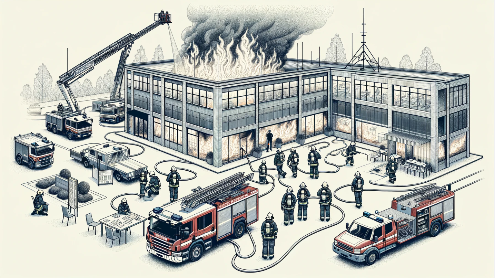
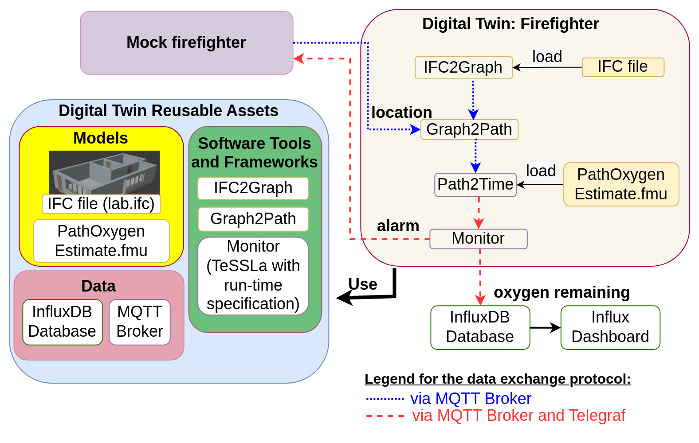

# Firefighter Use Case
In an firefighter mission it is important to monitor the oxygen levels of each firefighters Self Contained Breating Aparatus (SCBA) in context of their mission. 


## Physical Twin Overview

> Image: Schematic overview of a firefighter mission. Note the mission commander on the lower left documenting the air supply pressure levels provided by radio communication from the firefighters inside and around the burning building. This image was created with the assistance of DALL·E 2.


We assume the following scenario:
* a set of firefighters work to extinguish a burning building
* they each use an SCBA with pressurised oxygen to breath
* a mission commander on the outside coordinates the efforts and surveills the oxygen levels

## Digital Twin Overview
In this example a monitor is implemented, that calculates how much time the firefighers have left, until they need to leave the building. To that end, the inputs 
* 3D-model of the building in which the mission takes place, 
* pressure data of a firefighters SCBA and 
* firefighters location inside of the building 

are used to approximate
1) the shortest way out,
2) how much time this will need and
3) how much time is left until all oxygen from the SCBA is used up.

The remaining mission time is monitored and the firefighter receive a warning if it drops under a certain threshold. 





This example is an implementation of the the paper _Digital Twin for Rescue Missions--a Case Study_ by Leucker et al.: https://ceur-ws.org/Vol-3507/paper4.pdf


## Run the example
Before runnnig this example please make sure the following files are at the correct locations:
```
   digital_twins/o5g/main.py
   digital_twins/o5g/sensorSimulation.py
   digital_twins/o5g/telegraf.conf
   digital_twins/o5g/runTessla.sh
   digital_twins/o5g/config
   data/lab.ifc
   models/graphToPath.py
   models/pathToTime.py
   models/PathOxygenEstimate.mo
   models/makefmu.mos
   tools/ifc_to_graph
   tools/tessla/tessla-telegraf-connector/
   tools/tessla/tessla-telegraf-connector/specification.tessla
```

### Configure
All configuration for this example is contained in `digital_twins/o5g/config`.

To use the MQTT-Server, account information needs to be provided. The topics are set to their default values, which allow the DT to access the mock physical twins sensor metrics and to send back alerts. 

> export O5G_MQTT_SERVER=
export O5G_MQTT_PORT=8090
export O5G_MQTT_USER=
export O5G_MQTT_PASS=

> export O5G_MQTT_TOPIC_SENSOR='vgiot/ue/metric'
export O5G_MQTT_TOPIC_AIR_PREDICTION='vgiot/dt/prediction'
export O5g_MQTT_TOPIC_ALERT='vgiot/dt/alerts'


This example uses InfuxDB as a data storage, which will need to be configured to use your Access data. The following configuration steps are needed:
    - Log into the InfluxDB Web UI (Default Port 8086 on DTaaS), you will need the following:
    - Your org name below your username in the sidebar
    - Create a data bucket if you don't have one already in `Load Data -> Buckets`
    - Create an API access token in `Load Data -> API Tokens`, Copy and save this token somewhere immediately, you can not access it later!

> export O5G_INFLUX_SERVER=
export O5G_INFLUX_TOKEN=
export O5G_INFLUX_ORG=
export O5G_INFLUX_BUCKET=

This example can also use Grafana to visualize the data. If you don't need Grafana set `5G_SETUP_GRAFANA` to 'false' in the `config` file. To use Grafana Log into the WEB UI (Default Port 8088 on DTaaS) and in `Administration -> Service Accounts` add a new service account. Create a new Token for this Service Account to use and enter it in the config. 

> export O5G_SETUP_GRAFANA=true   # set to 'false' to skip grafana setup
export O5G_GRAFANA_SERVER=
export O5G_GRAFANA_TOKEN=


### Lifecycle

The lifecycle of this digital twin is structured in the following phases:
#### Install

Run the install script by executing
```bash
lifecycle/install
```
This will install all the required dependencies from apt and pip, aswell as OpenModellica and Telegraf from their respective repos.

#### Create

Run the create script by executing
```bash
lifecycle/create
```
This will compile the modelica modell to a Functional Mockup Unit (FMU) for the correct platform and setup Grafana, if enabled.

#### Exceute

To run the Digital Twin execute 
```bash
lifecycle/execute
```

This will start all the required components in a single tmux session called `o5g` in the background. To view the running Digital Twin attatch to this tmux session by executing
```bash
tmux a -t o5g
```
To detatch press `Ctrl-b` followed by `d`.


The Tmux session contains 4 components of the Example
 - Top Left: Sensor simulator generating random location and O2-level data
 - Top Right: Main Digital Twin receives the sensor data and calculates an estimate of how many minutes of air remain
 - Bottom Left: Telegraf to convert between different message formats, also displays all messages between components
 - Bottom Right: TeSSLa monitor raises an alarm, if the remaining time is to low.

#### Terminate

To stop the all components and close the tmux session execute
```bash
lifecycle/terminate
```

#### Clean

To remove temoporary files created by the Digital Twin execute
```bash
lifecycle/clean
```