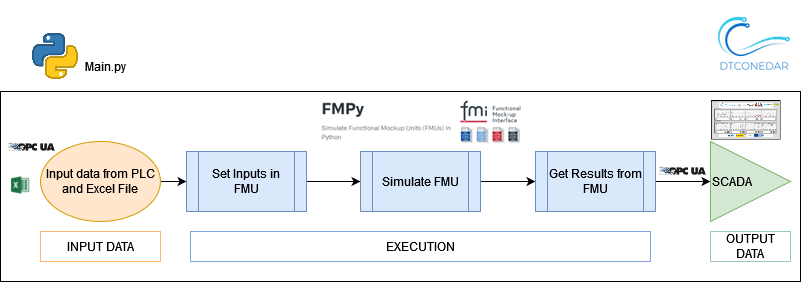
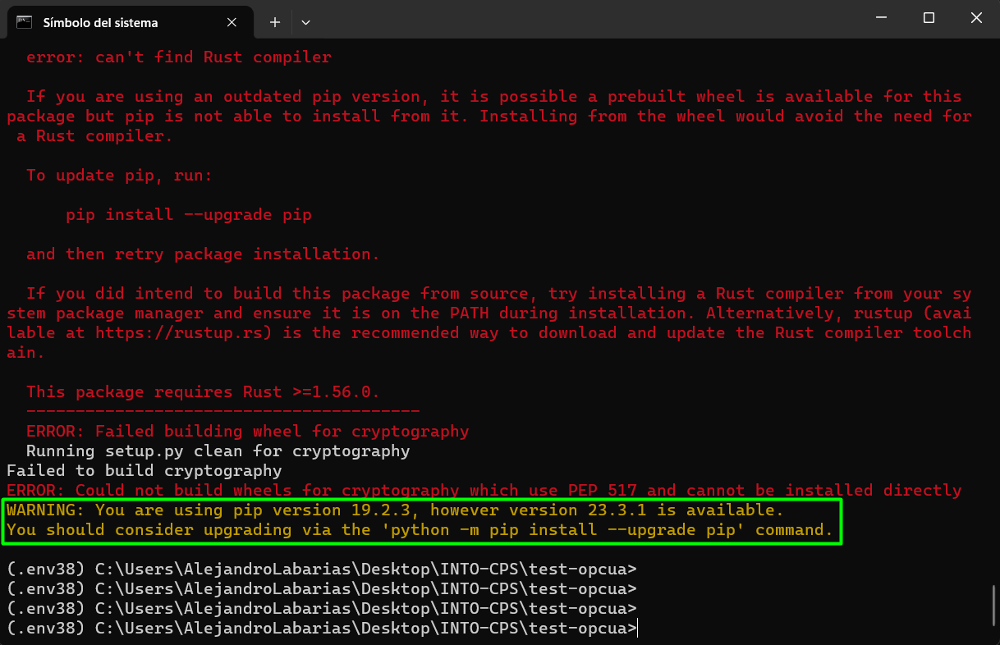
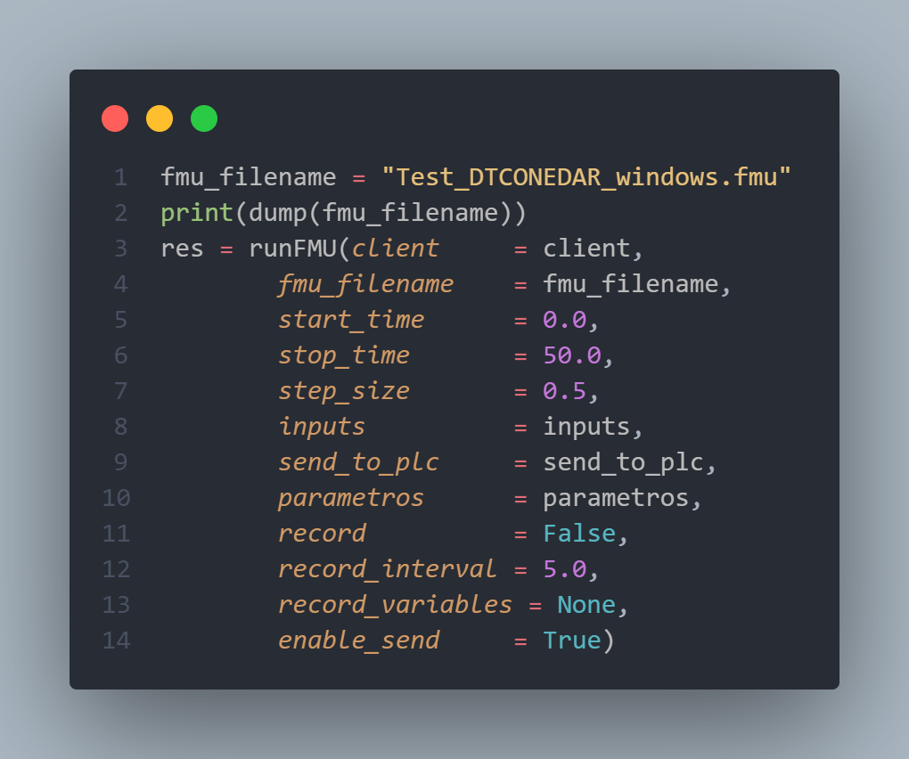

# Waste Water Plant with OPC UA

## Physical Twin Overview

This example demonstrates the communication between a physical waste
water plant in the tertiary treatment and a digital twin of the UV
disinfection process based on CFD and compartment models.

The physical twin of the waste water plant is composed of an ultraviolet
channel with a PLC that controls the power of the lamps needed to kill
all the pathogens of the flow. The dose to be applied (related with
the power) changes according to the residence time (computed from the measure
of the volume flow) and the UV intensity (measured by the intensity sensor).
The information of the volumetric flow and power (in the three parts of
the channel) is transmitted to the PLC of the plant. Furthermore, the PLC is
working as OPC UA Server to send and receive data to and from a client OPC.
Additionally, some sizing parameters and initial values are read from
a spreadsheet filled in by the plant operator. In this case, the spreadsheet
is an Open Office file (.ods) due to the software installed in the SCADA PC.
Some of the variables like initial concentration of disinfectant and
pathogens are included, among others. Some values defined by the plant
operator correspond to input signals that are not currently being measured
but are expected to be measured in the future.

## Digital Twin Overview

The digital twin is a reduced model (developed in C) that solves physical
conservation laws (mass, energy and momentum), but simplifies details
(geometry, mainly) to ensure real-time calculations and accurate results.
The results are compared to the ones obtained by the CFD. C solver developed
is used by the OpenModelica model. OpenModelica converts it into FMI standard,
to be integrated in the main script execution (_main.py_).

The main python script (_main.py_) does the following actions:

- Read values from PLC using a client OPC.
- Read the excel file to fix initial values, parameters and some inputs
  (those inputs that are not being measured and a reasonable value must
  be assumed).
- Execute the algorithm with the FMPy library using the .fmu created from
  the compartment model (based on CFD)
  - Obtain results.
  - Send by OPC UA protocol the result values to the PLC, to visualize them
    in the SCADA and with the aim to improve the decision-making process of
    the plant operator.

## Digital Twin Configuration

This example uses two models, one tool, one data, and two scripts to create
mock physical twin. The specific assets used are:

| Asset Type | Name of Asset | Visibility | Reuse in Other Examples |
|:----|:----|:----|:----|
| Models | Test_DTCONEDAR_linux.fmu | private | No |
|  | Test_DTCONEDAR_windows.fmu | private | No |
|  | Test_DTCONEDAR.mo | private | No |
| Data | Mock data generated by Main.py | private | No |
| Tool | Main.py | private | No |

The _configuration.ods_ file is used for customizing the initial values
to your needs. In this example, a dummy model representation of the plant
is used, instead of the real model. The simplified model (with not
the real equations) is developed in **Modelica
(Test_DTCONEDAR.mo)**. The FMU is generated from the Open Modelica interface in
Linux to obtain the binaries in Linux. The python script contains
the read, execution and extraction of results.

## Install and Demonstrate

1. Install GLIBC 2.33 or newer versions. The Windows has Visual Studio Redistributable which comes with GLIBC equivalent libraries.
   - **Linux**: You can install with `sudo apt-get install -y glibc-source`
     on Ubuntu 22.04. Please see
     [install GLIBC-2.35](https://askubuntu.com/questions/1408049/how-can-i-get-glibc-2-35-on-ubuntu-20-04)
     for Ubuntu 20.04.
   - **Windows**: [Install Visual Studio Redistributable](https://learn.microsoft.com/en-US/cpp/windows/latest-supported-vc-redist?view=msvc-170)
     to install the newest version of GLIBC.
1. Install Python 3.8 or above. It has been tested in 3.8, 3.10 and 3.11 versions. However **version 3.10 is recommended**: 
   - **Linux**: [Install Python 3.10](https://computingforgeeks.com/how-to-install-python-on-ubuntu-linux-system/).
   - **Windows**: [Install Python 3.10](https://www.python.org/downloads/release/python-31013/)
1. Install pip for Python
   - **Linux**: [Install pip3 for python3.10](https://stackoverflow.com/questions/69503329/pip-is-not-working-for-python-3-10-on-ubuntu/).
   `curl -sS https://bootstrap.pypa.io/get-pip.py | python3.10`
   - **Windows**: pip is installed by default when installing Python.
1. Install pip dependencies. 
   - **Linux**: `pip3.10 install fmpy opcua odfpy pandas cryptography`
   - **Windows**: Make sure that the desired Python virtual environment is activated (see `.env38` in the figure below). Then run the following command `pip install fmpy opcua odfpy pandas cryptography`. During the package installation, `cryptography` package may cause an error like this:
   
   Upgrade pip `python -m pip install --upgrade pip`.
   Run again `pip install fmpy opcua odfpy pandas cryptography` and it should install all the required packages correctly.

1. Install Prosys OPC UA Simulation Server [here](https://www.prosysopc.com/opcua/apps/JavaServer/dist/5.4.6-148/prosys-opc-ua-simulation-server-linux-x64-5.4.6-148.sh). **This server is not running properly in DTaaS user workspace but works well on Ubuntu 22.04.**
   **It seems there is a bug in the OPC UA server. This needs debugging.**
1. Start OPC UA server once and then close. This action will create
   `~/.prosysopc/prosys-opc-ua-simulation-server` directory.
1. Copy _default.simconf_ file into
   `~/.prosysopc/prosys-opc-ua-simulation-server` directory. After that, when running again Prosys OPC UA the following nodes should appear.
   
1. Start the OPC UA server again
    - Make sure that the server is running at a port. Copy
       **Connection Address (UA TCP)**. This is used inside `Main.py`
1. Configure parameters and inputs of the simulation in the file *configuration.ods*.

1. Open the script `Main.py`
   1. Replace `url = 'opc.tcp://Ubuntu.myguest.virtualbox.org:53530/OPCUA/SimulationServer'` with new **Connection Address**.
   2. Make sure that your are running the FMU that suits your Operating System.
      - **Linux**: `fmu_filename = "Test_DTCONEDAR_linux.fmu"`
      - **Windows**: `fmu_filename = "Test_DTCONEDAR_windows.fmu"`
      
   3. Besides the fmu_filename other optional parameters can be modified:
      - stop_time
      - step_size
      -	record = True, if we want to save the results of the simulation
      -	record_interval. Sometimes the simulation step_size is small and a the size of the results file can be too big. For instance, if the simulation step_size is 0.01 seconds, we can increase the record_interval so as to reduce the result file. 
      -	record_variables: we can specify the list of variables that we want to record.
      -	enable_send = True, if we want to send results to the OPC UA Server. 

1. Run the script.
   `python Main.py`

## Future steps

1. Simulate the OPC UA Server with a different tool, for instance, FreeOPCUA
since Prosys has does not run properly in DTaaS user workspace.
1. Develop an FMU for OPC UA communication and test the cosimulation in DTaaS
of the two FMUs:
    1. The FMU that models the physic behaviour of the plant and
    2. The FMU responsible for the OPC UA communication.
