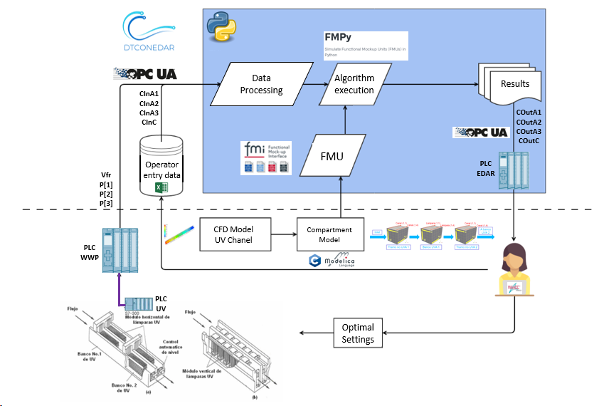
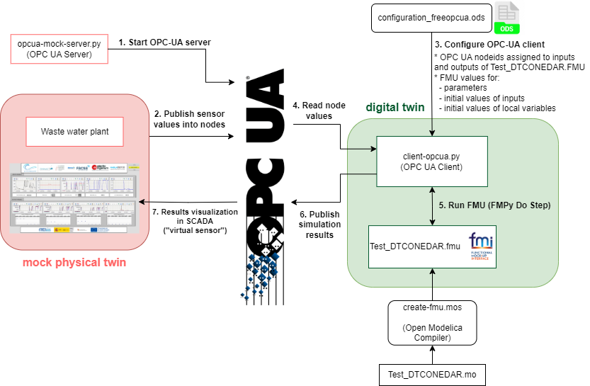
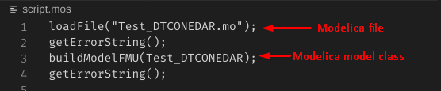
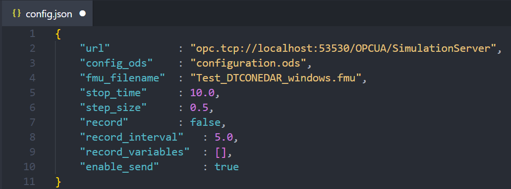
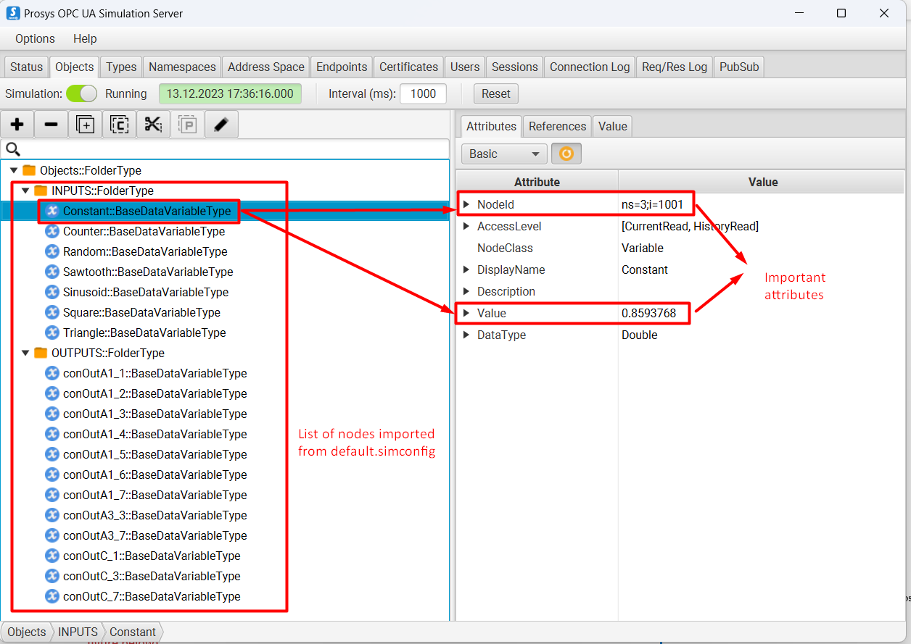

# Waste Water Plant with OPC UA

## Introduction
Waste water treatment (WWT) plants must comply with substance and species concentration limits established by regulation in order to ensure the good quality of the water. This is usually done taking periodic samples that are analyzed in the laboratory. This means that plant operators do not have continuous information for making decisions and, therefore, operation setpoints are set to higher values than needed to guarantee water quality. Some of the processes involved in WWT plants consume a lot of power, thus adjusting setpoints could significantly reduce energy consumption.

## Physical Twin Overview
This example demonstrates the communication between a physical ultraviolet (UV) disinfection process (the tertiary treatment of a WWT plant) and its digital twin, which is based on Computational Fluid Dynamics (CFD) and compartment models. The aim of this digital twin is to develop "virtual sensors" that provide continuous information that facilitates the decision making process for the plant operator. 



The physical twin of the waste water plant is composed of an ultraviolet
channel controlled by a PLC that controls the power of the UV lamps needed to kill all the pathogens of the flow. The channel has 3 groups of UV lamps, therefore the real channel (and is mathematical model) is subdivided in 7 zones: 4 correspond to zones without UV lamps (2 for the entrance and exit of the channel + 2 zones between UV lamps) and the 3 reamaining for the UV lamps. 

The dose to be applied (related with the power) changes according to the residence time (computed from the measure of the volume flow) and the UV intensity (measured by the intensity sensor). 
The information of the volumetric flow and power (in the three parts of the channel) is transmitted to the PLC of the plant. 
Furthermore, the PLC is working as OPC UA Server to send and receive data to and from an OPC UA client. 
Additionally, some sizing parameters and initial values are read from
a spreadsheet filled in by the plant operator. In this case, the spreadsheet
is an Open Office file (.ods) due to the software installed in the SCADA PC.
Some of the variables like initial concentration of disinfectant and
pathogens are included, among others. Some values defined by the plant
operator correspond to input signals that are not currently being measured,
but are expected to be measured in the future.

## Digital Twin Overview


The digital twin is a reduced model (developed in C) that solves physical
conservation laws (mass, energy and momentum), but simplifies details
(geometry, mainly) to ensure real-time calculations and accurate results.
The results are compared to the ones obtained by the CFD. C solver developed
is used by the OpenModelica model. OpenModelica converts it into FMI standard,
to be integrated in the main script execution (_client-opcua.py_).



The main python script (_client-opcua.py_) does the following actions:

- Read values from PLC using a client OPC.
- Read the spreadsheet to fix initial values, parameters and some inputs
  (those inputs that are not being measured, a reasonable value is assumed). And read the node IDs assigned to each input and output variable of the OPC UA server.
- Execute the algorithm with the FMPy library using the .fmu created from
  the compartment model (based on CFD)
  - Obtain results.
  - Send by OPC UA protocol the result values to the PLC, to visualize them
    in the SCADA and with the aim to improve the decision-making process of
    the plant operator.

## Digital Twin Configuration

| Asset Type | Name of Asset | Visibility | Reuse in Other Examples |
|:----|:----|:----|:----|
| Models | Test_DTCONEDAR_linux.fmu | private | No |
|  | Test_DTCONEDAR_windows.fmu | private | No |
|  | Test_DTCONEDAR.mo | private | No |
| Data | model_description.csv (generated by client-XXX.py) | private | No |
|  | configuration_freopcua.ods  | private   | No  |
|  | configuration_prosys.ods  | private   | No  |
|  | nodes-export.xml  | private   | No  |
| Tool | **Server**: server-opcua.py, server-asyncua.py, server-opcua-xml.py, server-asyncua-xml.py  | private | No |
|      | **Client**: client-opcua.py, client-asyncua.py | private | No |
|      | **FMU builder**: script.mos | private | No |

The _configurationXXX.ods_ file is used for customizing the initial values
to your needs. In this example, a dummy model representation of the plant
is used, instead of the real model. The simplified model (with not
the real equations) is developed in **Modelica
(Test_DTCONEDAR.mo)**. The FMU is generated from the Open Modelica interface in
Linux and Windows to obtain the needed binaries to run the FMU in both operating systems. It is possible to run an FMU previously generated, however, to ensure that we are using the right binaries it is recommended to install Open Modelica Compiler and run `script.mos` to build the FMU from de Modelica file `Test_DTCONEDAR.mo`

## Install and Demonstrate

1. Install GLIBC 2.33 or newer versions. The Windows has Visual Studio Redistributable which comes with GLIBC equivalent libraries.
   - **Linux**: You can install with `sudo apt-get install -y glibc-source`
     on Ubuntu 22.04. Please see
     [install GLIBC-2.35](https://askubuntu.com/questions/1408049/how-can-i-get-glibc-2-35-on-ubuntu-20-04)
     for Ubuntu 20.04.
   - **Windows**: [Install Visual Studio Redistributable](https://learn.microsoft.com/en-US/cpp/windows/latest-supported-vc-redist?view=msvc-170)
     to install the newest version of GLIBC.
1. Install Open Modelica Compiler for [Linux](https://openmodelica.org/download/download-linux/) or [Windows](https://openmodelica.org/download/download-windows/). The minimal installation is enough since the graphical clients (OMEdit, OMShell and OMNotebook) are not necessary. **This allows to compile an FMU from the terminal, therefore if the FMU is already built with the correct binaries, this step is optional**
1. Run the `script.mos` file to compile the FMU from the Modelica file.
   

   Linux
   ``` bash
   omc script.mos
   ```
   Windows: omc usually is located in a path like this
   ``` cmd
   "C:\Program Files\OpenModelica1.21.0-64bit\bin\omc.exe" script.mos
   ```
1. Install Python 3.8 or above. It has been tested in 3.8, 3.10 and 3.11 versions. However **version 3.10 is recommended**: 
   - **Linux**: [Install Python 3.10](https://computingforgeeks.com/how-to-install-python-on-ubuntu-linux-system/).
   - **Windows**: [Install Python 3.10](https://www.python.org/downloads/release/python-31013/)
1. Install pip for Python
   - **Linux**: [Install pip3 for python3.10](https://stackoverflow.com/questions/69503329/pip-is-not-working-for-python-3-10-on-ubuntu/).
   `curl -sS https://bootstrap.pypa.io/get-pip.py | python3.10`
   - **Windows**: pip is installed by default when installing Python.
1. Upgrade pip and install pip dependencies. 

   Linux
      ``` bash
      python3 -m pip install --upgrade pip
      python3 -m pip install requirements_linux.txt
      ```
      Windows
      ```cmd
      py -m pip install --upgrade pip
      py -m pip install requirements_windows.txt
      ```

1. Configure an OPC UA simulation server. Two options are available.
   1. Use [Free OPC-UA Library](https://github.com/FreeOpcUa). This is the recommended approach, because its configuration is more straightforward. Two libraries are provided within Free OPC-UA Library.
      - [opcua](https://github.com/FreeOpcUa/python-opcua) is deprecated, but still works fine to create OPC-UA servers and clients.
      - [asyncua](https://github.com/FreeOpcUa/opcua-asyncio) is very similar, but allows asynchronous programming through the [asyncio](https://docs.python.org/es/3/library/asyncio.html) Python native library.
   2. Install Prosys OPC UA Simulation Server [here](https://www.prosysopc.com/opcua/apps/JavaServer/dist/5.4.6-148/prosys-opc-ua-simulation-server-linux-x64-5.4.6-148.sh). **This server is not running properly in DTaaS user workspace but works well on Ubuntu 22.04.**
   **It seems there is a bug in the OPC UA server. This needs debugging.** To configure Prosys OPC UA Simulation Server see [How to configure Prosys](#how-to-configure-prosys).

1. Start the OPC-UA Server (two options available):
   - **Free OPC-UA Library**: run any of these scripts (`server-opcua.py`, `server-opcua-xml.py`, `server-asyncua.py`, `server-asyncua-xml.py`). All of them create the same server, the difference between them is that ones use opcua library and others asyncua and ones define each node by hand and others import a list of nodes from a .xml file.
   - **Prosys OPC UA Simulation Server**: just run the application.
1. Configure parameters and inputs of the simulation model in the file *configuration.ods*.


1. Open the configuration file *config.json* and fill in the values:


   2. Replace `"url" : "opc.tcp://0.0.0.0:4840"` with new **Connection Address**. The default localhost is:
      - `opc.tcp://0.0.0.0:4840` for Linux
      - `opc.tcp://localhost:4840` for Windows

   2. Select the .ods configuration file. 
      - If using Free OPC-UA select `configuration_freeopcua.ods`
      - If using Prosys select `configuration_prosys.ods`

   2. Make sure that your are running the FMU that suits your Operating System. The easiest way is to provide the same _fmu_filename_ that has been created after running **step 3**.
      
   2. Besides the mentioned parameters, optional parameters can be modified:
      - stop_time
      - step_size
      -	record = True, if we want to save the results of the simulation
      -	record_interval. Sometimes the simulation step_size is small and a the size of the results file can be too big. For instance, if the simulation step_size is 0.01 seconds, we can increase the record_interval so as to reduce the result file size. 
      -	record_variables: we can specify the list of variables that we want to record.
      -	enable_send = True, if we want to send results to the OPC UA Server. 

1. Run any of the following client scripts: `client-opcua.py` or `client-asyncua.py`

## Future steps

1. FreeOPCUA server in DTaaS user worksapce is working properly, but Prosys server does not run in DTaaS user workspace. **There is an error when running the FMU: 'version GLIBC 2.33 not found'**.
1. Develop an FMU for OPC UA communication and test the cosimulation in DTaaS
of the two FMUs:
    1. The FMU that models the physic behaviour of the plant and
    2. The FMU responsible for the OPC UA communication.

## How to configure Prosys
1. Start OPC UA server once and then close. This action will create
   `~/.prosysopc/prosys-opc-ua-simulation-server` directory (within your operating system).
1. Go to `prosys` folder (within this repository) and copy `default.simconf` file into
   `~/.prosysopc/prosys-opc-ua-simulation-server` directory. After that, when running again Prosys OPC UA the following nodes should appear.
   
1. Start the OPC UA server again. Make sure that the server is running at a port. Copy **Connection Address (UA TCP)** from the **Status** tab.  

## References
1. Royo, L., Labarías, A., Arnau, R., Gómez, A., Ezquerra, A., Cilla, I., & Díez-Antoñazas, L. (2023). Improving energy efficiency in the tertiary treatment of Alguazas WWTP (Spain) by means of digital twin development based on Physics modelling . Cambridge Open Engage. [doi:10.33774/coe-2023-1vjcw](https://doi.org/10.33774/coe-2023-1vjcw)

## Acknowledgements
This project is subsidised thanks to the support grants for Agrupación Empresarial Innovadora (AEI) of the Ministry of Industry, Trade and Tourism (MINCOTUR) with the aim of improving the competitiveness of small and medium-sized enterprises within the Recovery, Transformation and Resilience Plan (PRTR) financed by the Next Generation EU (NGEU) funds, with Grant Number: AEI-010500-2022b-196.