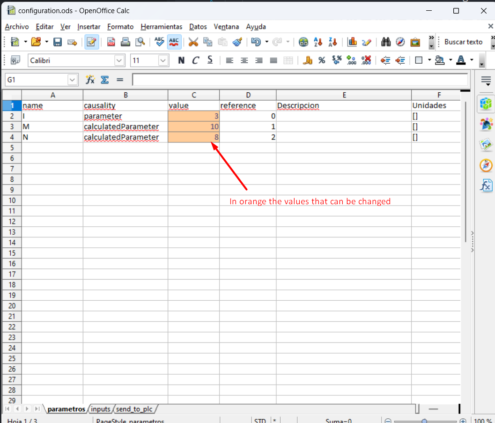

# Install and Demonstrate

1. Install Python 3.8 or above. It has been tested in 3.8, 3.10 and 3.11 versions. However **version 3.10 is recommended**: 
   - **Linux**: [Install Python 3.10](https://computingforgeeks.com/how-to-install-python-on-ubuntu-linux-system/).
   - **Windows**: [Install Python 3.10](https://www.python.org/downloads/release/python-31013/)
1. Install pip for Python
   - **Linux**: [Install pip3 for python3.10](https://stackoverflow.com/questions/69503329/pip-is-not-working-for-python-3-10-on-ubuntu/).
   `curl -sS https://bootstrap.pypa.io/get-pip.py | python3.10`
   - **Windows**: pip is installed by default when installing Python.
1. Install pip dependencies. 
   - **Linux**: `pip3.10 install fmpy opcua odfpy pandas cryptography`
   - **Windows**: Make sure that the desired Python virtual environment is activated (see `.env38` in the figure below). Then run the following command `pip install fmpy opcua odfpy pandas cryptography`. During the package installation, `cryptography` package may cause an error like this:
   
   Upgrade pip `python -m pip install --upgrade pip`.
   Run again `pip install fmpy opcua odfpy pandas cryptography` and it should install all the required packages correctly.
   
1. Install Prosys OPC UA Simulation Server [here](https://www.prosysopc.com/opcua/apps/JavaServer/dist/5.4.6-148/prosys-opc-ua-simulation-server-linux-x64-5.4.6-148.sh). **This server is not running properly in DTaaS user workspace but works well on Ubuntu 22.04.**
   **It seems there is a bug in the OPC UA server. This needs debugging.**
1. Start OPC UA server once and then close. This action will create
   `~/.prosysopc/prosys-opc-ua-simulation-server` directory.
1. Copy _default.simconf_ file into
   `~/.prosysopc/prosys-opc-ua-simulation-server` directory. After that, when running again Prosys OPC UA the following nodes should appear.
   
1. Start the OPC UA server again
    - Make sure that the server is running at a port. Copy
       **Connection Address (UA TCP)**. This is used inside `Main.py`
1. Configure parameters and inputs of the simulation in the file *configuration.ods*.

1. Open the script `Main.py`
   1. Replace `url = 'opc.tcp://Ubuntu.myguest.virtualbox.org:53530/OPCUA/SimulationServer'` with new **Connection Address**.
   2. Make sure that your are running the FMU that suits your Operating System.
      - **Linux**: `fmu_filename = "Test_DTCONEDAR_linux.fmu"`
      - **Windows**: `fmu_filename = "Test_DTCONEDAR_windows.fmu"`
      
   3. Besides the fmu_filename other optional parameters can be modified:
      - stop_time
      - step_size
      -	record = True, if we want to save the results of the simulation
      -	record_interval. Sometimes the simulation step_size is small and a the size of the results file can be too big. For instance, if the simulation step_size is 0.01 seconds, we can increase the record_interval so as to reduce the result file. 
      -	record_variables: we can specify the list of variables that we want to record.
      -	enable_send = True, if we want to send results to the OPC UA Server. 

1. Run the script.
   `python Main.py`
