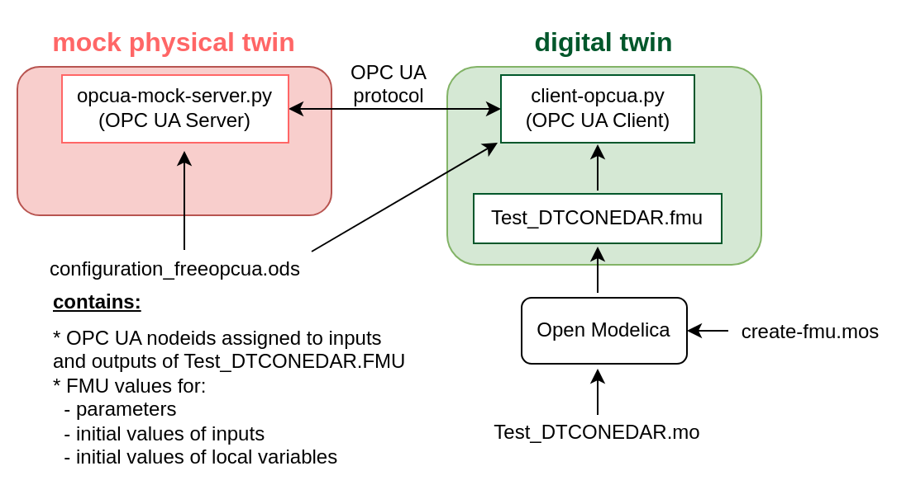

# Waste Water Plant with OPC UA

## Introduction

Waste water treatment (WWT) plants must comply with substance and species
concentration limits established by regulation in order to ensure the good
quality of the water. This is usually done taking periodic samples that
are analyzed in the laboratory. This means that plant operators do not have
continuous information for making decisions and, therefore, operation
setpoints are set to higher values than needed to guarantee water quality.
Some of the processes involved in WWT plants consume a lot of power, thus
adjusting setpoints could significantly reduce energy consumption.

## Physical Twin Overview

This example demonstrates the communication between a physical waste
water plant in the tertiary treatment and a digital twin of
the ultaviolet (UV) disinfection process based on Computational Fluid
Dynamics (CFD) and compartment models. The aim of this digital twin is to
develop "virtual sensors" that provide continuous information that
facilitates the decision making process for the plant operator. 


The physical twin of the waste water plant is composed of an ultraviolet
channel controlled by a PLC that controls the power of the UV lamps needed
to kill all the pathogens of the flow. The channel has 3 groups of UV lamps,
therefore the real channel (and is mathematical model) is subdivided into
7 zones: 4 correspond to zones without UV lamps (2 for the entrance and exit
of the channel + 2 zones between UV lamps) and the 3 reamaining for
the UV lamps. 

The dose to be applied (related with the power) changes according to
the residence time (computed from the measure of the volume flow) and
the UV intensity (measured by the intensity sensor). 

The information of the volumetric flow and power (in the three parts of
the channel) is transmitted to the PLC of the plant. 
Furthermore, the PLC is working as OPC UA Server to send and receive
data to and from an OPC UA client. 
Additionally, some sizing parameters and initial values are read from
a spreadsheet filled in by the plant operator. In this case, the spreadsheet
is an Open Office file (.ods) due to the software installed in the SCADA PC.
Some of the variables like initial concentration of disinfectant and
pathogens are included, among others. Some values defined by the plant
operator correspond to input signals that are not currently being measured,
but are expected to be measured in the future.

## Digital Twin Overview


The digital twin is a reduced model (developed in C) that solves physical
conservation laws (mass, energy and momentum), but simplifies details
(geometry, mainly) to ensure real-time calculations and accurate results.
The results are compared to the ones obtained by the CFD. C solver developed
is used by the OpenModelica model. OpenModelica converts it into
the FMI standard, to be integrated in the main script execution (_main.py_).



The main python script (_main.py_) does the following actions:

- Read values from PLC using a client OPC.
- Read the spreadsheet to fix initial values, parameters and some inputs
  (those inputs that are not being measured, a reasonable value is assumed).
- Execute the algorithm with the FMPy library using the .fmu created from
  the compartment model (based on CFD)

  - Obtain results.
  - Send by OPC UA protocol the result values to the PLC, to visualize them
    in the SCADA and with the aim to improve the decision-making process of
    the plant operator.

## Digital Twin Configuration

| Asset Type | Name of Asset | Visibility | Reuse in Other Examples |
|:----|:----|:----|:----|
| Model | Test_DTCONEDAR.mo | private | No |
| Data | model_description.csv (generated by client-XXX.py) | private | No |
|  | configuration_freopcua.ods  | private   | No  |
| Tool | **Server**: server-asyncua.py | private | No |
|      | **Client**: client-asyncua.py | private | No |
|      | **FMU builder**: script.mos | private | No |

The _configurationXXX.ods_ file is used for customizing the initial values
to your needs. In this example, a dummy model representation of the plant
is used, instead of the real model. The simplified model (with not
the real equations) is developed in **Modelica
(Test_DTCONEDAR.mo)**. The FMU is generated from the Open Modelica interface
to obtain the needed binaries to run the FMU. It is possible to run an FMU
previously generated, however, to ensure that we are using the right binaries
it is recommended to install Open Modelica Compiler and run `script.mos`
to build the FMU from the Modelica file `Test_DTCONEDAR.mo`.

## Install and Demonstrate

1. Install Open Modelica Compiler for
[Linux](https://openmodelica.org/download/download-linux/). The minimal
installation is enough since the graphical clients
(OMEdit, OMShell and OMNotebook) are not necessary.
**This allows to compile an FMU from the terminal, therefore if the FMU
is already built with the correct binaries, this step is optional**
1. Run the `script.mos` file to compile the FMU from the Modelica file.
   

   ``` bash
   omc script.mos
   ```
   ```

1. Install 
   [Install Python 3.10](https://computingforgeeks.com/how-to-install-python-on-ubuntu-linux-system/).
1. Install pip for Python
   [Install pip3 for python3.10](https://stackoverflow.com/questions/69503329/pip-is-not-working-for-python-3-10-on-ubuntu/).

   ```bash
   curl -sS https://bootstrap.pypa.io/get-pip.py | python3.10
   ```

1. Upgrade pip and install pip dependencies. 

      ```bash
      python3.10 -m pip install --upgrade pip
      python3.10 -m pip install requirements_linux.txt
      ```

1. Start the OPC-UA Server:

   ```bash
    python3.10 server-asyncua.py &
   ```

1. Configure parameters and inputs of the simulation model in the file *configuration.ods*.

   

   

1. Open the configuration file *config.json* and fill in the values:

   

   Optional parameters can be modified:

      - stop_time
      - step_size
      -	record = True, if we want to save the results of the simulation
      -	record_interval. Sometimes the simulation step_size is small and
        a the size of the results file can be too big. For instance,
        if the simulation step_size is 0.01 seconds, we can increase
        the record_interval so as to reduce the result file size. 
      -	record_variables: we can specify the list of variables that we
        want to record.
      -	enable_send = True, if we want to send results to the OPC UA Server. 

1. Run the client: ``client-asyncua.py`

