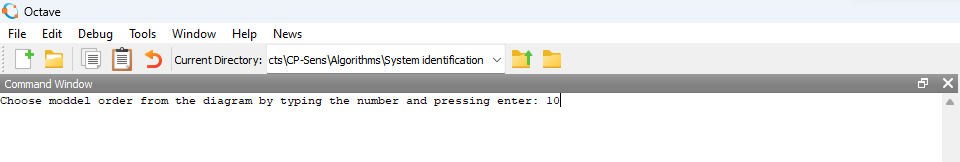
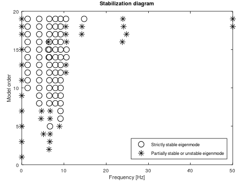
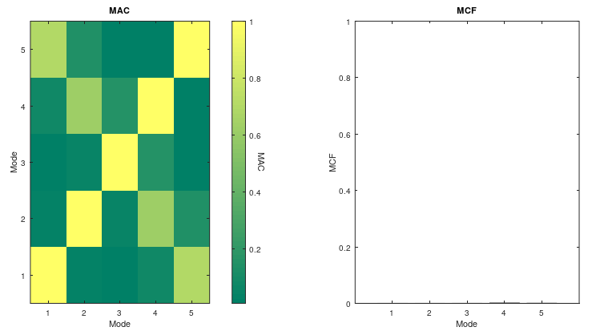
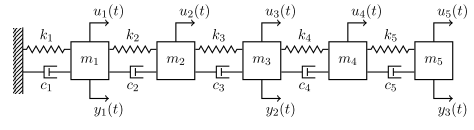

# Stochastic system identification based on vibration data

## Introduction

Stochastic system identification is the operation by which a mathematical
model of a system is inferred based on output-only measurements from
the considered system. In the context of vibratory mechanical and
structural systems, the output conventionally consists of measured
kinematic responses, such as accelerations and/or displacements.
The present code contains an implementation of a particular stochastic
system identification method; namely, stochastic subspace
identification (SSI), which infers a stochastic state-space model from
constructed data subspaces. Such state-space model can, for example,
provide modal parameter estimates of the considered system, which
can be used in the context of building a representative digital twin.

## Organization of the code

The code consists of the main file `Input_SysID` and the function files
`SSI_Data`
and `Stab_Diag`. The `Input_SysID` file also serves as the only file in
which input must be provided by the user. In particular, there is an Input
plugin section within the file, where the user must provide
the following inputs:

1. _FileName_, which is the name of the measurement data file.
1. _Fs_, which is the sampling frequency in Hertz.
1. _otype_, which designates the measurement type; 0=displacements, 1=velocitites, and 2=accelerations.
1. _nmax_, which is the maximum model order allowable in the subspace identification.
1. _nblock_, which is the number of block rows used in the subspace identification.

In addition to the requirements in the Input plugin section, the user
will also, as depicted below, be asked to specify the model order in
the command window during the run of the code. The model order must be
an integer larger or equal to 2 and smaller or equal to nmax. The choice
can be based on a stabilization diagram that will appear concurrently.
An example of such a stabilization diagram is also shown below.





The main file `Input_SysID` calls to the function file `SSI_Data`, in which the subspace identification algorithm is contained. The `SSI_Data` file calls to the function file `Stab_Diag`, in which the previously mentioned stabilization diagram is computed as a part of the subspace identification.

The outputs of the code are the figures _Stab_diagram.png_ and _MAC_MCF.png_,
which will appear during the run of the code, plus the document _sys.txt_.
The _sys.txt_ file contains the estimated eigen characteristics of
the considered system and the specified parameter otype.
The Stabilization diagram figure shows the stabilization attained in
the system identification, and the MAC-MCF figure shows the resulting
modal assurance criteria (MAC) and modal complexity factors (MCFs) associated
with the final system identification model. Examples of
_Stab_diagram.png_ and _MAC_MCF.png_ are shown below. The outputs are all
saved in the subfolder /Results.



## Example overview

This example demonstrates the application of SSI to the depicted
mass-spring-damper system with five degrees of freedom (DOF). The system,
which is simulated with a sampling frequency of 100 Hz, is subjected to
stochastic input, u(t), that has been low-pass-filtered such that it
excites the first three eigen modes of the system. The simulated output, y(t),
is composed of accelerations at DOF 1, 3, and 5. The aim of the example
is to estimate the (modal) parameters of the identifiable eigenmodes
using SSI.



### Example inputs

In terms of code inputs in the present example, we specify the following in
the Input plugin section in the file `Input_SysID`:

1. FileName=’Acc_5DOF.txt’.
1. Fs=100.
1. otype=2.
1. nmax=20.
1. nblock=30.

When running the code, we are asked to specify the model order
in the command window. Here, we choose an order of 10, as we infer
from the generated stabilization diagram that all the identified eigenmodes
with this order are stable.

### Example outputs

Upon finalization of the code run, we attain the _sys.txt_ file,
the Stabilization diagram and MAC_MCF diagram.

## References

More information on subspace identification is available in
the following book:

```txt
van Overschee, P. & De Moor, B. Subspace identification for linear systems: Theory - implementation – applications, 1st Edition, Kluwer Academic Publishers, 1996.
[doi:10.1007/978-1-4613-0465-4](https://doi.org/10.1007/978-1-4613-0465-4)
```

## Acknowledgements

The documented work has been conducted in the project Cyber-Physical Sensing
for Machinery and Structures (CP-SENS), which is funded by
the Innovation Fund Denmark.