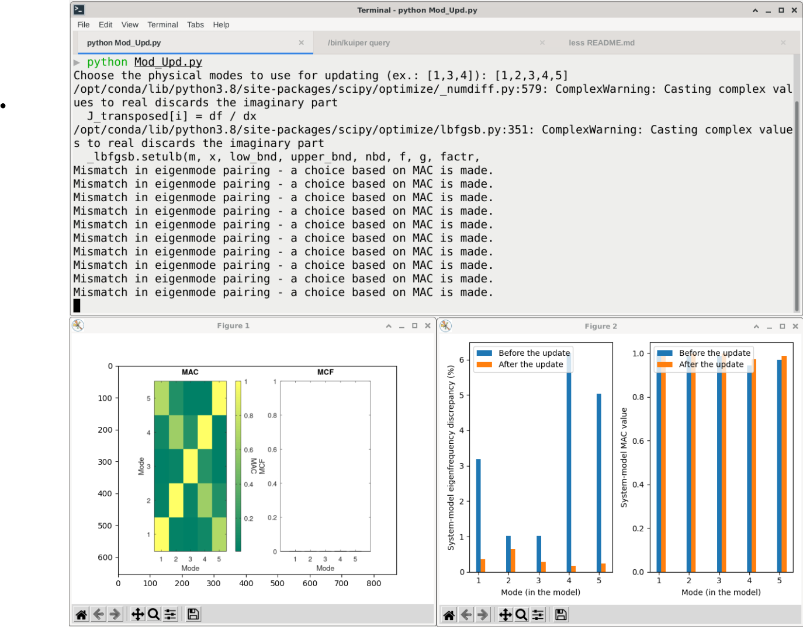

# Model Updating

This example demonstrates **Model Updating** based on
Stochastic system identification (SSI) obtained from vibration data.

## Introduction

This code conducts model updating based on the sensitivity approach with
modal features extracted by stochastic system identification (SSI) method
from vibration measurements.

## Example overview

This application shows a sensitivity-based model updating technique
on a 5 degrees of freedom (DOF) spring-dashpot series system.
The system is the same as used in the system identification example.
A repetition is followed for clarity. The system, which is simulated with
a sampling frequency of 100 Hz, is subjected to stochastic input, u(t),
that has been low-pass-filtered such that it excites the first
three eigenmodes of the system. The simulated output, y(t), is composed
of accelerations at DOF 1, 3, and 5. During this example, it is considered
that the values regarding 1st, 2nd, 4th and 5th stiffness element will be updated.


## Organization of the Code

The code is organized in a single file. The default input values
should work fine;
the user can also modify input values in the `main()` function.

The code also requires availability of _MAC-MCF.png_ file in
_../system-identification/Results_ directory.

The inputs, used from
the system identification method, are loaded through a json file: `sys.json`,
i.e. from SSI method and the subjected parameters are :

1. omegas: eigen-frequencies
1. zetas: damping ratios
1. Phis: mode shapes
1. FS: sampling frequencies,
1. otype: response type

The initialization would be changed depending on the system;
so user need to update these parameters if based on their selected system.
The initialization of parameters to be provided by users are:
`(how do users provide these - via a file, or input at terminal??)`

1. Initial mass of the model
   m  = [1]*5
2. Initial stiffness of the model
   k  = [1000]*5
3. Number of parameters will be updated in stiffness matrix
   PaR = np.array([1,2,4,5])

The output of the code is stored in `modUpd.json` containing
the updated mass, damping, and stiffness matrices along with information
on the output DOF and the modes used in the model updating.

The script requires user to provide inputs during execution.
The user must, in
the command window, specify the modes to use in the updating during
the run of the code. This can be based on a figure showing
the modal assurance criterion (MAC) values and the modal complexity factors
(MCFs) that will appear during the run.

The reference figure for  MAC and MCF will be as follow:


## Use

The user must execute the code using

```python
python3 Mod_Upd.py
```

### Example inputs

The input for this code is taken from `sys.json` file.

The code will ask to user to provide the modes number needs to be updated
and it will be provided as follows:

```bash
"Choose the physical modes to use for updating (ex.: [1,3,4]): ")
```

A sample screenshot is given below.



### Example Outputs

Depending on the system, the mass and stiffness matrices need to be initialized.
Also, there is a provision to declare the expected number of elements in
stiffness matrix need to be updated.

After a successful run, the script will produce a figure comparing
the eigen-frequencies and MAC values before and after model updating.
The results will be shown in the image below:


The script will also save information about the number of modes investigated
for updating as well as the location of the observed response. This data will be
saved in the output file `modUpd.json`.
