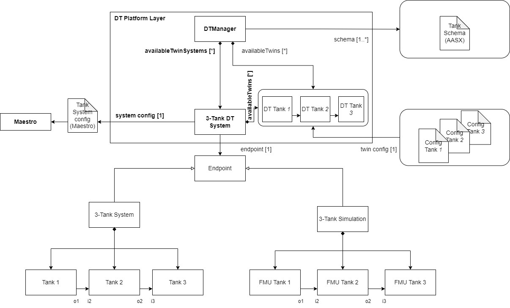

# Three-Tank System Digital Twin
## Overview
The three-tank system is a simple case study allows us to represent a system that is composed of three individual components that are coupled in a cascade as follows: The first tank is connected to the input of the second tank, and the output of the second tank is connected to the input of the third tank.


This example contains only the simulated components for demonstration purposes; therefore, there is no configuration for the connection with the physical system.

The three-tank system case study is managed using the ```DTManager```, which is packed as a jar library in the tools, and run from a java main file.
The ```DTManager``` uses Maestro as a slave for co-simulation, so it generates the output of the co-simulation.
The main file can be changed according to the application scope, i.e., the ```/workspace/examples/tools/three-tank/TankMain.java``` can be manipulated to get a different result.

The ```/workspace/examples/models/three-tank/``` folder contains the ```Linear.fmu``` file, which is a non-realistic model for a tank with input and output and the ```TankSystem.aasx``` file for the schema representation with Asset Administration Shell.
The three instances use the same ```.fmu``` file and the same schema due to being of the same object class.
The ```DTManager``` is in charge of reading the values from the co-simulation output.

## Example Structure


## Digital Twin Configuration
This example uses two models, two tools, one data, and one script. The specific assets used are:

| Asset Type | Names of Assets | Visibility | Reuse in Other Examples |
|:---|:---|:---|:---|
| Model | Linear.fmu | Private | No |
|  | TankSystem.aasx | Private | No |
| Tool | maestro-2.3.0-jar-with-dependencies.jar | Common | Yes |
|  | DTManager-0.0.1-Maestro.jar | Private | Yes |
|  | TankMain.java (main script) | Private | No |
| Data | outputs.csv | Private | No |


## Lifecycle Phases
The lifecycles that are covered include:
1. Installation of dependencies in the create phase.
2. Execution of the experiment in the execution phase.
3. Terminating the background processes and cleaning up the outputs in the termination phase.

## Run the Example
The order the run this example is:
1. Run the create script file with ```/workspace/examples/digital twins/three-tank/lifecycle/create```. In case of error, be sure the installed version of Java is OpenJDK 11, otherwise, install manually the OpenJDK 11 and use the command ```update-java-alternatives``` to set the Java version to be OpenJDK 11 and rerun the ```create``` script.
2. Execute the Digital Twin with the script file ```/workspace/examples/digital twins/three-tank/lifecycle/execute```.
3. Terminate the background processes with the script file ```/workspace/examples/digital twins/three-tank/lifecycle/terminate```.
7. (Optional) clean up the output folder with the script file ```/workspace/examples/digital twins/three-tank/lifecycle/clean```. 

## Examining the results
Executing this Digital Twin will generate a co-simulation output, but the results can also be monitored from updating the ```/workspace/examples/tools/three-tank/TankMain.java``` with a specific set of ```getAttributeValue``` commands, such as shown in the code.
That main file enables the online execution of the Digital Twin and its internal components.

The output of the co-simulation is generated to the ```/workspace/examples/data/three-tank/output``` folder.


In the default example, the co-simulation is run for 10 seconds in steps of 0.5 seconds.
This can be modified for a longer period and different step size.
The output stored in ```outputs.csv``` contains the level, in/out flow, and leak values.

No data from the physical twin are generated/used.

## References

More information about the DT Manager is available at:

```txt
D. Lehner, S. Gil, P. H. Mikkelsen, P. G. Larsen and M. Wimmer, "An Architectural Extension for Digital Twin Platforms to Leverage Behavioral Models," 2023 IEEE 19th International Conference on Automation Science and Engineering (CASE), Auckland, New Zealand, 2023, pp. 1-8, doi: 10.1109/CASE56687.2023.10260417.
```